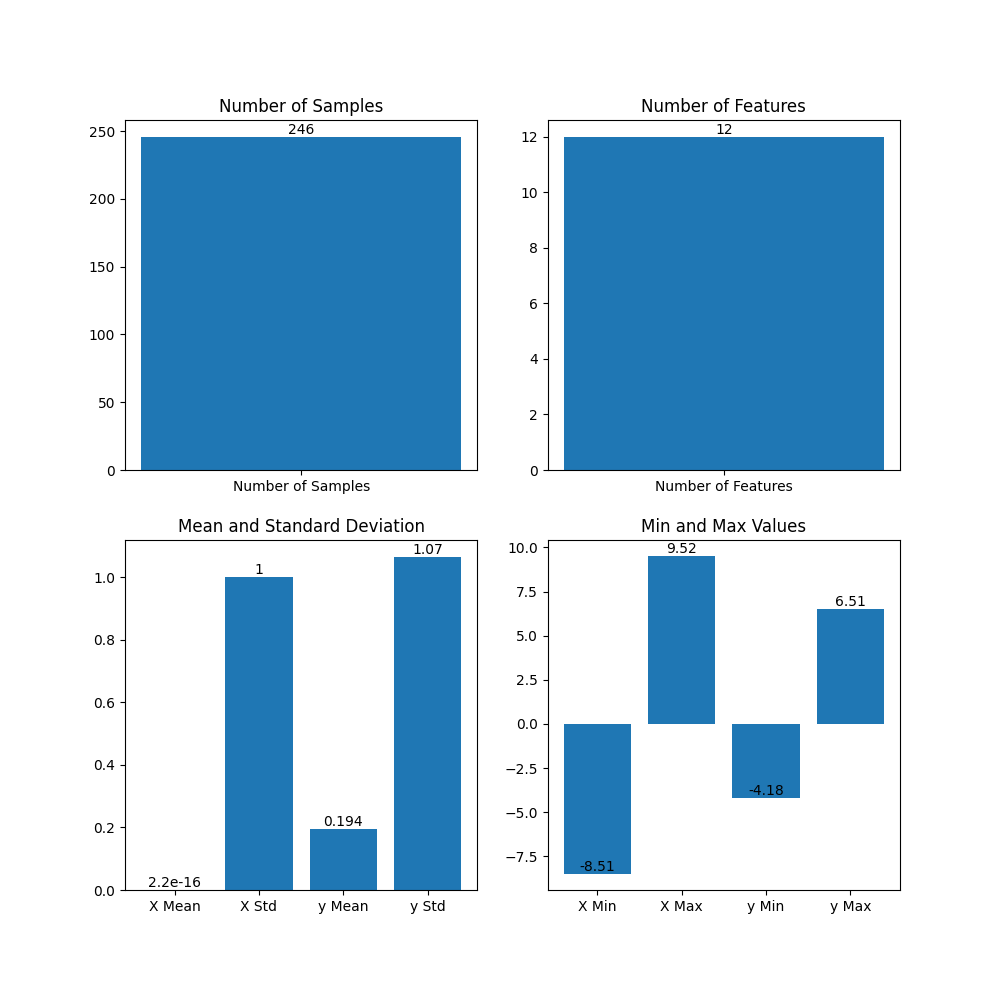

# NBA Pistons Report
**PLEASE VIEW REPORTS FOR CURRENT REPORTS.   THIS IS HERE AS A TEMPORARY OPTION.**

## Table of Contents

- [NBA Pistons Report](#nba-pistons-report)
  - [Table of Contents](#table-of-contents)
  - [Goals](#goals)
  - [Key Features](#key-features)
  - [Analytics](#analytics)

## Goals

- Primary goal: Determine which players on the Detroit Pistons are valuable after 1 season of play.
- Secondary goals:
  - Understand the data and perform analytics on its specifications and data insights.
  - Perform basic statistical modeling on the data.
  - Use neural nets like MLP, ARIMA, and LSTM to predict what to do with the players.

## Key Features

- Collect and analyze data on Detroit Pistons players.
- Perform statistical modeling and analysis on the data.
- Use neural networks like MLP, ARIMA, and LSTM for player predictions.
- Generate insights and analysis based on the data.

## Analytics

Data Specifications:

- Original DataFrame: Entries=13210, Unique Players=2377
- Filtered DataFrame: Entries=950, Unique Players=190

Insights and Analysis:

- [Insight 1]
- [Insight 2]
- [Insight 3]
